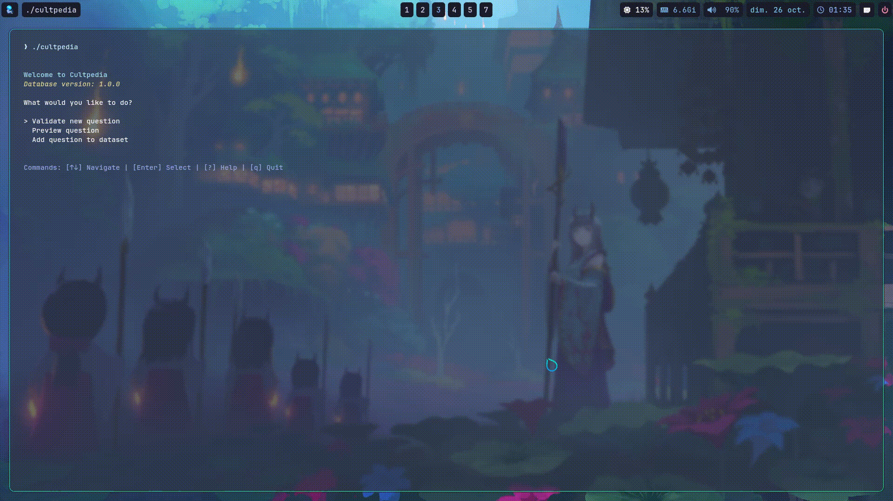

# Contributing to Cultpedia

Thank you for your interest in contributing to Cultpedia! Your contributions help improve the quality and diversity of the content.

## Table of Contents

- [Code of Conduct](#code-of-conduct)
- [Getting Started](#getting-started)
- [Contributing Questions](#contributing-questions)
- [Contributing Code](#contributing-code)

## Code of Conduct

By participating, you agree to maintain a respectful and inclusive environment. Harassment or discriminatory behavior will not be tolerated.

## Getting Started

You have to **Fork the repository** on GitHub and clone your fork into your local machine.

   ```bash
   git clone https://github.com/Culturae-org/cultpedia.git
   cd cultpedia
   ```

### Build the cultpedia tool

You have two ways to get the **cultpedia tool**, you can get the pre-built binary or build it from source.

- [Use Release](#use-release)
- [Manual build](#manual-build)

### Use Release

If you want to use the pre-built binary releases, go to the [Releases page](https://github.com/Culturae-org/cultpedia/releases). Download the ZIP file for your platform, extract it, and run the `cultpedia` binary (or `cultpedia.exe` on Windows).

> [!WARNING]
> You have to move the binary into the cloned repository folder to use it with datasets (see this step [Fork](#getting-started)).

### Manual Build

   **Linux/macOS:**
   ```bash
   ./build.sh
   ```

   **Windows:**
   ```bash
   build.bat
   ```

   **Manual build:**
   ```bash
   go build -o cultpedia ./cmd
   ```

   > [!TIP]
   > If you use **Nix**, you can set de development environment (binary will be built automatically)

**Familiarize yourself** with the [data format](FORMAT.md).

## Contributing Questions

### Quick Start

> [!IMPORTANT]
> Not edit the files questions.ndjson directly Use the interactive TUI tool described below!

1. Sure you have do the **previous steps :**
      - **Fork**
      - **Clone**
      - **Build the tool**

2. **Edit [`datasets/new-question.json`](../datasets/new-question.json)** (only this file have to be modified)
   - Create your question in this file
   - follow this [guidelines](../docs/FORMAT.md) for question content
   - Each line must be valid JSON (JSON format)
   - Use [question.example.json](../schemas/question.example.json) as a template

3. Run the TUI tool to validate and add your question, follow **Validate new question** and **Add question to dataset** steps.



### Add a question

When you have create or edit your question in `datasets/new-question.json`, use the interactive TUI tool to add it to the main dataset.


> [!WARNING]
> Dont edit **.ndjson** and **manifest.json** files directly.

3. **Push to your fork** and **create a Pull Request**.

Sure you have the last version of the main branch before push your changes.

4. **CI will automatically**:
   - ✓ Validate all questions
   - ✓ Check for duplicates
   - ✓ Verify all translations
   - ✓ Reject if unwanted files were modified

5. Reviewers will check your PR, may request changes, and finally merge it.

### Important Rules

- **Only modify** `datasets/general-knowledge/questions.ndjson`
- **Do not commit** manifest.json, themes.ndjson, subthemes.ndjson, or tags.ndjson
- These files are updated automatically by the CI

## Thank You!

We appreciate your contributions to Cultpedia! Your efforts help create a richer educational resource for everyone.

## Additional Resources

- [Data Format Guide](FORMAT.md)
- [JSON Schema](../schemas/question.schema.json)
- [Example Question](../datasets/new-question.json)